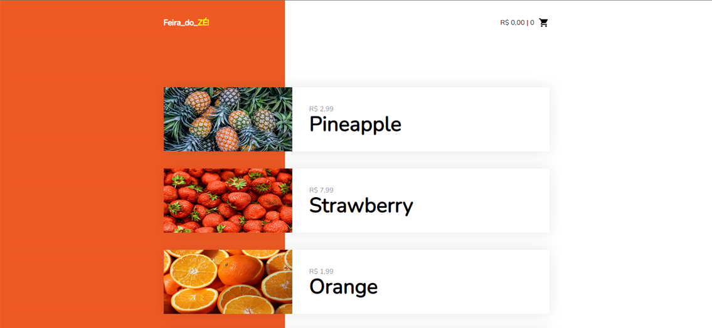

<h1 align="center">
 
    FEIRA_DO_ZÉ!

</h1>

A SPA project in order to apply basics knowledges in Vue.js, responsive and simulating API query

## Features

Below are all features used on this project:

- **HTML5** — Standard markup language
- **CSS3** — Stylization language
- **Javascript** — Programming language
- **Vue.js** — Front-end Framework
- **Fetch API** — j-son files

 

## Getting started

You can access the app through this link:
https://feiradoze.netlify.app 
You can clone and use the repository anytime as well.  
If you don't remember how, follow this GitHub official link below in order to get the doc:
https://docs.github.com/pt/github/creating-cloning-and-archiving-repositories/cloning-a-repository-from-github/cloning-a-repository

 
